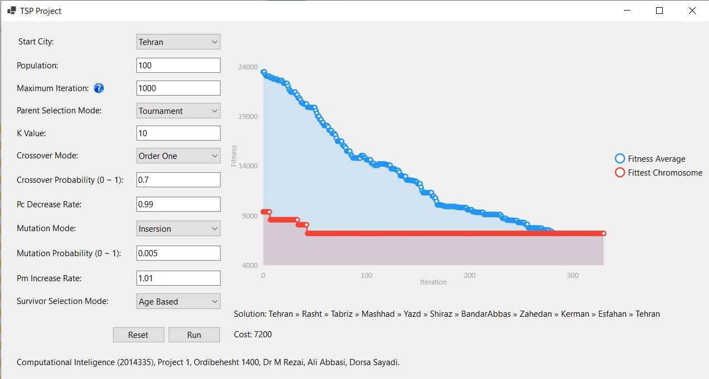

# Genetic Algorithm for Travelling Salesman Problem (TSP)
Genetic Algorithm (GA) is a search algorithm inspired by the theory of natural evolution 
([Read more on Wikipedia](https://en.wikipedia.org/wiki/Genetic_algorithm)).  In this project, the genetic algorithm is used to find a solution for the Traveling Salesman Problem (TSP).
You can set the start city, population size, maximum iteration (for when the results are not converging), parent selection mode, crossover mode and its probability, the rate of decreasing the probability of crossover, mutation mode and its probability, the rate of increasing the probability of mutation, and survivor selection mode.

**Supported Parent Selection Modes:**
 * Tournament
 * Rank-based
 * Stochastic
 * Roulette Wheel
 
**Supported Crossover Modes:**
 * Order One
 * Rotation-based

**Supported Mutation Modes:**
 * Insertion
 * Inversion
 * Scramble
 * Swap

**Supported Survivor Selection Modes:**
 * Age-based
 * Fitness-based
 

## How to Use
Before the start, make sure that `.NET5` is installed on your computer, then compile the project using Microsoft Visual Studio 2019 while you are connected to the internet, and the required packages will be installed automatically.
